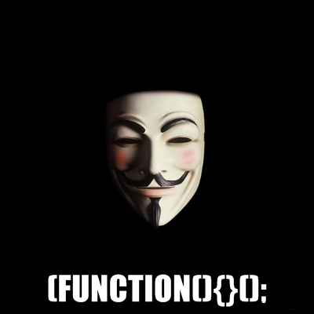

A common pattern you will see in AngularJS is angular code being wrapped in a Self Executing Anonymous Function (SEAF) such as a directive  being attached to an angular module. A SEAF is also known as an IIFE which is short for Immediately-Invoked Function Expression.

## What is a Self Executing Anonymous Function (SEAF)?

In order to create modular code in javascript one technique is to wrap your code in a SEAF.

```

(function(){

    var greetingPartOne = "Hello";
    var greetingPartTwo = "World!";
    
    function salutation() {
        alert(greetingPartOne + " " + greetingPartTwo);
    }
    
    salutation();
   
})();

```

The SEAF consists of the anonymous function

```

(function(){
})

```

and the two brackets at the end that immediately executes the code contained in the preceeding parentheses.

```

();

```

Although the SEAF describes the anonymous function as being *executed* the IIFE description of *invoked* is more accurate.

## Anonymous Function

The use of the anonymous function creates a closure which prevents access to the variables and functions that it contains.
 
So in the example below the alerting of the variables and the call to the salutation function from outside the SEAF will not work as they are not available to code external to the anonymous function.


```

(function(){

    var greetingPartOne = "Hello";
    var greetingPartTwo = "World!";
    
    function salutation() {
        alert(greetingPartOne + " " + greetingPartTwo);
    }
    
    salutation();
   
})();

alert(greetingPartOne);
alert(greetingPartTwo);
salutation();

```

The usage of the variables and function outside the SEAF will result in Reference Errors being thrown by the javascript compiler.

```
Exception: ReferenceError: greetingPartOne is not defined

Exception: ReferenceError: greetingPartTwo is not defined

Exception: ReferenceError: salutation is not defineded
```


## The SEAF pattern in jQuery

This SEAF pattern is used extensively by jQuery developers when wishing to pass the jQuery object into an anonymous function to create and attach objects as properties or methods that can be accessed without exposing the objects publicly. It also prevents any variable naming collisions by keeping the variables private and internal to the anonymous function.

```

(function($){

    //jQuery is available here as $
    
    var arr = []; //this is private
    
    $.addItem = function(item) {
      arr.push(item);
    }

})(jQuery);

// arr can't be accessed here
// jQuery.addItem can be accessed here.

```

## The SEAF pattern in AngularJS

The typical example would be a controller being added to an angular module being wrapped in a self executing anonymous function. In the example below the wrapping SEAF is not being utalised as the code block is being wrapped in an anonymous function which is encapsulating 
the code within its local function scope. 

But it is good practice to include it within your javascript code and many developers code editors are set up to include a SEAF code snippet in a new javascript file. Coupled with the *'use strict'* directive which enables strict mode that will throw errors if it encounters, for example, undeclared variables.

```
(function(){

 "use strict";

    angular.module('appMod')
    .controller('appCtrl', ['dep1', function(dep1){
      //..
      // Code block here
      //..
    }])
   
})();
```


The code seen below separates the controllers anonymous function out into a named function keeping the angular related code more 
cleaner and makes use of the SEAF to locally scope the MainCtrl function. This makes the code more modular keeping our functions and variables local while still being able to connect our controller to the angular.module('app').

```
(function () {

    'use strict';
    
    function MainCtrl ($scope) {
        $scope.initalised = true;
    }
    
    angular.module('app').controller('MainCtrl', ['$scope', MainCtrl);
    
})();
```

So whether you call it a SEAF or an IIFE it is good practice to encapsulate your code in an anonymous function that can self invoke. 
