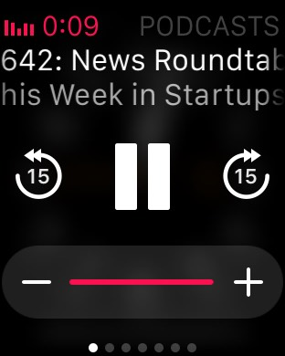
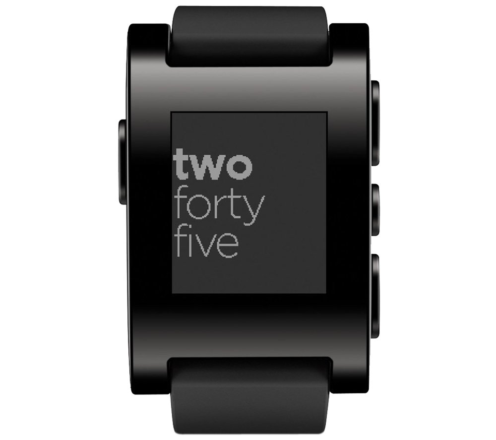
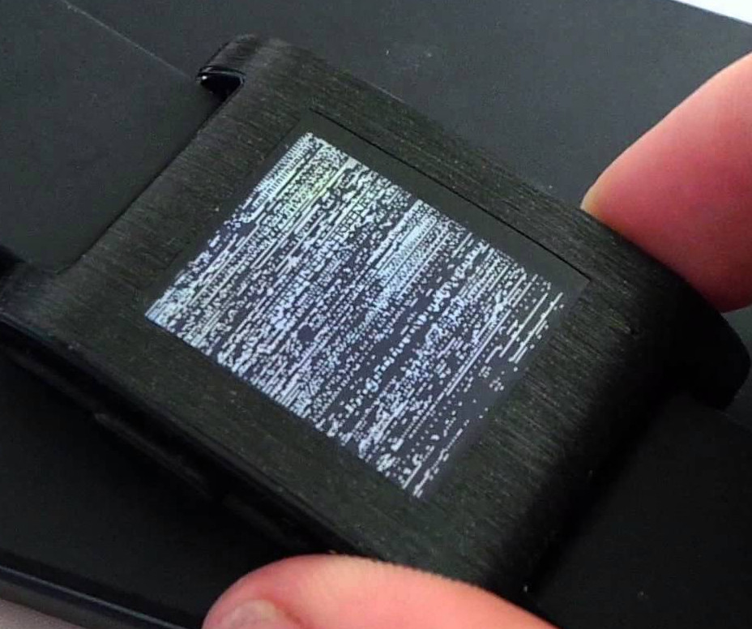
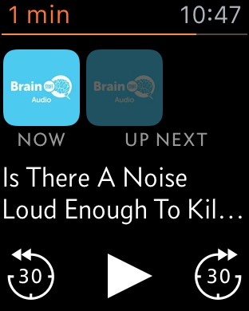
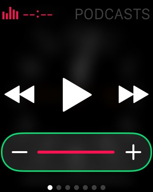
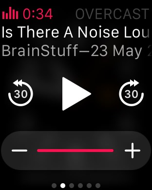

# Apple Watch Glances

As an avid listener of podcasts one of my biggest bugbears is the steps that I have to go 
through in order to skip a podcast backwards to listen again to a segment that I missed, or 
to skip past some intro music / advert that I have heard for the nth time.

It normally goes:

1. Interuption / what was that just said?
2. Take phone out of pocket / pick up phone
3. Wake up phone
4. Skip forward or backward on lock screen

Not very many steps you may think, but fetching the phone out of my pocket when mowing the 
lawn or walking the dog gets irritating especially when you have to stop to fish it out. 

## Pebble Watch

I have owned a smart watch in the form of a Pebble Watch from the first iteration that I 
backed on kickstarter. An it has served me well for nearly three years. The notification 
display coupled with the ability to accept or cancel an incoming phone call on the watch 
came to be features that I have rely on.

The feature that proved to be the most useful was the ability to control music and podcast 
playback on the watch. Pebble watches provided an interface to control volume, pause and 
play, fast forward/rewind to the next song or podcast. This was achieved via the three 
buttons on the right where you could alternate the functionality of the top and bottom 
buttons by pressing the middle button to toggle between volume and fast forward/rewind modes.

After a while it became apparent that there 
was a UX design flaw in the toggle functionality as there was no audible cue to which mode 
you were in and this lead to frustratingly fast forwarding to the end of the current podcast 
rather than adjusting volume.

The bad UX I could live with, but when the Pebble started screen tearing I began to 
entertain the possiblity of purchasing an Apple watch.

## Apple Watch no official podcast app

When I started considering an Apple watch to replace my Pebble watch I searched for reviews of 
Apple's podcast watch app and found out there was not an official app available. The good 
news was that other podcast app players such as Overcast did provide companion watch apps 
that allowed skipping. 

Although due to the amount of time I had spent curating the content of Apple's podcast player and 
general inertia I was not keen on switching, but if that was the only way to gain the skip 
functionality I would if needed.  

## Swipe up to glance at now playing

The Apple watch allows companion apps to implement a glance interface on the watch which is 
accessed by swiping up on the watch face screen. Glances are quick summaries of 
information provided by the apps that you select to appear in the glances menu.

While exploring the glances functionality of the Apple watch I came across the now playing 
glance that gave a hint that it could control podcast playback without the need for a 
dedicated watch app.

### Now playing glance

I started a podcast to investigate would the now playing glance expose the skip functionality?, 
to my delight it did. Also it allowed the adjusting of volume through the on screen 
touch enabled plus and minus buttons as well as via the digital crown.

### Apple Podcast now playing glance

### Overcast Podcast now playing glance

The same now playing information summary is also available for the Overcast App, which puts it 
on an even footing with the other official and third party music and podcast players.

## Apple watch podcast now playing glance pros and cons

### Podcast glance pros

Skip forward and back functionality. 

Easily accessed thorough the swipe up gesture. 

Changing of volume through on screen touch enabled plus and minus buttons. 

Ability to change volume via the digital crown. 

### Podcast glance drawbacks

No indication of how long is left of the podcast.
